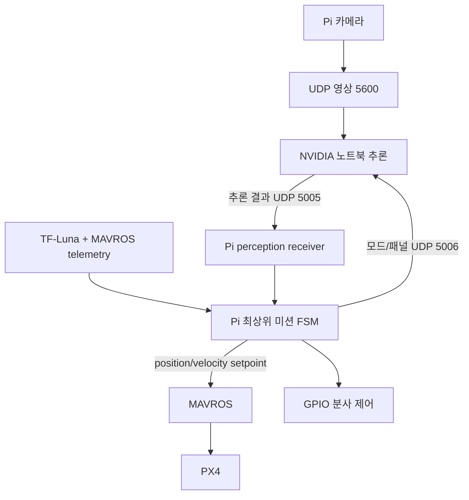

# DA-DAKA 무작위 패널 자율 청소 드론

[](https://github.com/KiHyeonLee1121/da-daka_Ai/actions/workflows/full-software-audit.yml)

Raspberry Pi 5가 QGroundControl(QGC)을 거치지 않고 PX4의 ARM, OFFBOARD 이동,
분사 순서, 원점 복귀와 착륙을 소유하고, NVIDIA GPU 노트북은 영상 추론만
담당하는 ROS 2 Jazzy 프로젝트다.

## 현재 상태

- 최종 시나리오의 소프트웨어 단계는 `main`의
  `autonomous_cleaning.launch.py`와 최상위 미션 FSM에 통합되어 있다.
- 임의 배치된 패널의 미터 좌표 추정, 이동 순서 계산, 프레임 진입 감속,
  거리·헤딩·노즐 위치 보정, 오염 판정, 분사 후 재검증, 재분사, 원점 복귀와
  착륙 경로가 구현되어 있다.
- Pi가 비행 제어권을 소유하며 노트북은 MAVROS setpoint, ARM, 비행 모드를
  제어할 수 없다.
- 소프트웨어 CI 통과는 실기체 비행 검증 완료를 뜻하지 않는다. 학습 모델,
  실측 보정값, GPIO 회로, 실제 장치 경로, 네트워크/GPU 환경과 단계별 현장
  시험은 별도로 완료해야 한다.
- `configuration_approved`, `calibration_approved`, 실제 분사 출력의 기본값은
  모두 닫혀 있다. 필요한 확인을 끝내기 전에는 미션 시작 또는 실제 분사가
  거부된다.

## 최종 임무

```text
PRECHECK -> ARMING -> TAKEOFF(3 m)
-> SURVEY -> PLAN_ROUTE -> DESCEND(분사 거리)
-> TRANSIT -> SLOW_APPROACH -> REACQUIRE -> ASSESS
   ├─ clean -> 다음 패널
   └─ dirty -> PRECISION_ALIGN -> SPRAY -> VERIFY
                 ├─ dirty -> PRECISION_ALIGN 후 재분사
                 └─ clean -> 다음 패널
-> RETURN_HOME -> AUTO.LAND -> COMPLETE
```

1. 이륙 기준점과 yaw를 저장하고 LiDAR 기준 3 m까지 이륙한다.
2. 전체 촬영 중 검출한 패널을 카메라 실측값, LiDAR 거리, MAVROS 자세로 지면
   좌표에 투영하고 여러 프레임 관측을 하나의 패널 지도로 합친다.
3. 무작위 배치 지도를 기준으로 nearest-neighbour와 2-opt로 이동 순서를
   계산한다.
4. 분사 거리로 하강하고 첫 패널의 근사 좌표로 이동한다. 목표 패널이 프레임에
   들어오면 즉시 접근 속도를 제한한다.
5. 목표 패널을 다시 확인하고 깨끗하면 건너뛴다. 오염됐다면 LiDAR 거리,
   이륙 yaw, 영상 중심과 카메라-노즐 오프셋을 함께 사용해 분사점을 맞춘다.
6. 분사 후 새 추론 결과로 오염을 재검증한다. 오염이 남으면 설정된 최대 횟수
   안에서 재정렬과 분사를 반복한다.
7. 모든 패널 처리가 끝나면 저장한 이륙 ENU 좌표로 복귀하고 `AUTO.LAND`로
   착륙한다.

QGC는 이 순서의 명령자가 아니다. 다만 상태 감시와 사람이 개입하는 비상
Hold/Land 수단으로 연결할 수 있다. 외부 조작으로 OFFBOARD가 해제되면 미션은
제어권을 자동으로 다시 빼앗지 않고 실패 처리한 뒤 외부에서 선택된 모드를
존중한다.

## 시스템 구조와 제어권



| 주체 | 소유하는 기능 | 소유하지 않는 기능 |
|---|---|---|
| Raspberry Pi 5 | 카메라 송신, LiDAR, 패널 지도/경로, 미션 FSM, MAVROS setpoint, ARM/OFFBOARD, 분사, 복귀/착륙 | CUDA 추론 |
| NVIDIA 노트북 | 패널 검출, ONNX 오염 segmentation, 결과/heartbeat 송신 | 비행 명령, GPIO, 미션 순서 |
| PX4/Pixhawk | 자세 안정화, 모터 출력, 비행 모드와 failsafe 실행 | 패널 인식과 청소 순서 판단 |
| QGC/조종자 | 선택적 감시, 비상 Hold/Land 또는 수동 개입 | 정상 자율 임무의 지속적인 명령 |

여러 ROS 노드는 하나의 launch로 실행되지만 MAVROS position/velocity setpoint는
최상위 `autonomous_cleaning_mission`만 발행한다. 거리 제어와 visual servo는
내부 명령 토픽만 사용한다. 중복 setpoint publisher나 과거 미션이 활성화되어
있으면 PRECHECK가 실패한다.

## 주요 구성

| 경로 | 역할 |
|---|---|
| `ros2_ws/src/da_daka_control` | Pi의 센서, 측량, 경로, 정렬, 분사와 최종 미션 노드 |
| `ros2_ws/src/da_daka_interfaces` | ROS 2 사용자 정의 메시지 |
| `laptop_ai` | CUDA 전용 ONNX 추론 worker와 성능 측정 도구 |
| `docs/autonomous_cleaning_architecture.md` | 최종 구조와 구현 연결 상세 |
| `docs/edge_gpu_offload_runbook.md` | Pi–노트북 GPU offload 연결, 안전 점검과 2026-08-16 현장 검증 결과 |
| `docs/field_diagnostics.md` | 좌표 투영과 카메라 진단 절차 |
| `docs/branch_consolidation.md` | 과거 브랜치 기능의 통합·대체 근거 |
| `tools` | 비행 명령을 내리지 않는 카메라/투영 진단 도구 |

Pi의 ROS 2가 Docker 안에서 실행되고 카메라 도구가 호스트에만 있는 경우,
`tools/edge_gpu_link.py`로 비행 노드 없이 카메라와 GPU 통신 경로만 실행할 수
있다. GPU 노트북에서 Pi 송출을 원격으로 시작하려면
`tools/gpu_laptop_start_pi_camera.sh`를 사용한다. 자세한 설정과 판정 기준은 GPU
offload runbook을 따른다.

루트의 `main.py`와 `control/`, `vision/` 등은 과거 bench/호환 시험용 코드다.
실제 비행 경로가 아니며 live backend는 fail-closed 상태다. 최종 ROS 미션과
동시에 실행하면 안 된다. 과거 `panel_mission`과 `panel_distance_mission`도
회귀시험 대상으로만 유지하며 실제 임무는 `autonomous_cleaning.launch.py`만
사용한다.

## Raspberry Pi에 최신 main을 안전하게 반영하기

Pi 저장소에 커밋하지 않은 파일이나 별도 변경이 있으면 그 폴더에서 바로
`git pull`, `git reset --hard`, `git clean`을 실행하지 않는다. 먼저 저장소
전체와 `.git`, 추적·비추적 파일을 복사하고, 로컬 보존 브랜치를 만든 뒤,
`origin/main`에서 시작한 별도 worktree에 Pi 변경을 파일별로 선별 적용한다.

안전 동기화는 다음 원칙을 지킨다.

- 저장공간과 저장소 확인 후 전체 폴더 백업
- Pi 로컬 변경의 목록화와 로컬 백업 커밋
- 최신 `origin/main` 기반 별도 worktree 구성
- 생성물은 제외하고 장치 설정과 사용자 변경만 선별 재적용
- 충돌별 의도 비교, ROS/Python 빌드·테스트, 정적 장치 확인
- 기존 폴더를 유지한 전환과 원상복구 보고

최신 main을 받은 뒤에도 Pi 실측 설정은 별도 로컬 배포 설정이나 명확히 식별된
커밋으로 관리한다. 토큰, 비밀번호, 개인키는 저장소에 커밋하지 않는다.

## 준비 환경

### Raspberry Pi 5

- Ubuntu 24.04와 ROS 2 Jazzy
- PX4와 연결된 MAVROS 2
- 필요할 경우 Pixhawk serial을 분기하는 `mavlink-router`
- `rpicam-vid`를 사용할 수 있는 카메라 환경
- TF-Luna serial 접근 권한
- 실제 분사 시 libgpiod와 GPIO 접근 권한
- 노트북과 통신할 전용 현장 네트워크

최종 launch는 MAVROS나 `mavlink-router` 자체를 시작하지 않는다. 먼저 현장
장치 경로로 이 둘을 구성하고 MAVROS 연결, local pose, velocity, battery,
system status, ARM과 mode service가 정상인지 확인해야 한다. Pixhawk serial은
한 프로세스만 열어야 한다. QGC와 MAVROS가 함께 필요하면
`ros2_ws/src/da_daka_control/config/mavlink-router.conf.example`을 복사해 실제
장치/baud/IP로 작성하고, router만 serial을 열며 MAVROS는 로컬 UDP endpoint를
사용하게 한다.

```bash
source /opt/ros/jazzy/setup.bash
cd ros2_ws
rosdep install --from-paths src --ignore-src -r -y
colcon build --symlink-install
source install/setup.bash
colcon test
colcon test-result --verbose
```

### NVIDIA 노트북

- NVIDIA GPU와 해당 GPU/OS에 맞는 드라이버
- 설치할 `onnxruntime-gpu`와 호환되는 CUDA 환경
- Python 3.10 이상
- FFmpeg/PyAV가 Pi의 H.264 MPEG-TS UDP 영상을 decode할 수 있는 환경

```bash
python -m venv .venv
source .venv/bin/activate
python -m pip install --upgrade pip
python -m pip install -e ./laptop_ai
nvidia-smi
da-daka-nvidia-check
```

`da-daka-nvidia-check`에서 `CUDAExecutionProvider`를 사용할 수 있어야 한다.
노트북 worker는 CPU-only ONNX Runtime으로 실제 판단을 대신하지 않고 시작을
거부한다.

## 네트워크 데이터 흐름

| 방향 | UDP 포트 | 데이터 |
|---|---:|---|
| Pi → 노트북 | 5600 | 저지연 H.264/MPEG-TS 카메라 영상 |
| 노트북 → Pi | 5005 | protocol-v2 패널/오염 추론 결과와 heartbeat |
| Pi → 노트북 | 5006 | `idle/survey/clean` 모드와 활성 패널 ID |

양쪽 설정의 Pi IP, 노트북 IP, `source_id`가 서로 일치해야 한다. receiver는 허용
IP/source ID, session, 증가하는 sequence/frame, timestamp, 값 범위와 timeout을
검사한다. IP allowlist는 암호학적 인증이 아니므로 인터넷과 분리된 AP, 방화벽,
고정 IP 또는 DHCP reservation을 함께 사용한다.

## 설정과 기동

저장소의 숫자는 안전한 기본값 또는 예시일 뿐이다. 아래 `직접 해야 할 작업`을
끝내기 전에는 승인값을 `true`로 바꾸거나 실제 GPIO 출력을 켜지 않는다.

### 1. 노트북 worker

`laptop_ai/config/laptop_ai.yaml`에서 학습 모델 경로와 실제 Pi IP를 설정한다.

```bash
source .venv/bin/activate
da-daka-laptop-ai --config laptop_ai/config/laptop_ai.yaml
```

실제 모델과 영상으로 지연과 정확도를 측정할 때 사용한다.

```bash
da-daka-segmentation-benchmark \
  --config laptop_ai/config/laptop_ai.yaml --runs 200
```

Pendulum 기반 optimizer는 측정 프로파일이 없으면 observe-only다. 예시 정확도와
지연값을 실제 측정으로 교체하기 전에는 encoder/model을 자동 변경하지 않는다.

### 2. Pi stack 진단 기동

다음 상태는 노드를 띄워 토픽, 카메라 스트림과 연결을 진단하기 위한 것이며,
승인 gate와 실제 분사가 닫혀 있어 전체 미션 시작은 의도적으로 거부된다.

```bash
source /opt/ros/jazzy/setup.bash
source ros2_ws/install/setup.bash
ros2 launch da_daka_control autonomous_cleaning.launch.py \
  laptop_ip:=<LAPTOP_IP> \
  video_stream_enabled:=true \
  configuration_approved:=false \
  calibration_approved:=false \
  spray_backend:=mock \
  spray_output_enabled:=false
```

### 3. 현장 승인 후 실기체 기동

아래 `<...>`는 복사해서 쓸 값이 아니다. 모두 해당 기체에서 확인한 값으로
교체하고, 프로펠러 제거 시험부터 단계별 검증을 통과한 뒤 사용한다.

```bash
ros2 launch da_daka_control autonomous_cleaning.launch.py \
  laptop_ip:=<LAPTOP_IP> \
  video_stream_enabled:=true \
  configuration_approved:=true \
  calibration_approved:=true \
  spray_backend:=gpio \
  spray_output_enabled:=true \
  gpio_chip:=<GPIO_CHIP_PATH> \
  gpio_line_offset:=<GPIO_LINE_OFFSET> \
  camera_to_nozzle_forward_m:=<MEASURED_FORWARD_M> \
  camera_to_nozzle_left_m:=<MEASURED_LEFT_M>
```

stack이 정상이고 비행구역이 통제된 뒤에만 시작한다.

```bash
ros2 service call /autonomous_cleaning/start std_srvs/srv/Trigger "{}"
```

운용자가 중단하면 미션은 abort를 latch하고 착륙을 요청한다.

```bash
ros2 service call /autonomous_cleaning/abort std_srvs/srv/Trigger "{}"
```

주요 상태는 `/autonomous_cleaning/state`, 결과는
`/autonomous_cleaning/result`, 현재 패널은
`/autonomous_cleaning/current_panel_id`에서 확인한다.

## 코드 밖에서 직접 해야 할 실측·물리·환경 작업

아래 항목은 코드로 임의 생성할 수 없는 배포 입력이다. 확인 결과와 단위,
측정 조건, 담당자, 날짜를 별도 비행기록에 남긴다.

### A. 카메라와 좌표계

| 해야 할 일 | 측정·확인 방법 | 반영 위치 |
|---|---|---|
| 1 m 지면 footprint | 장착 완료된 기체를 수평으로 고정하고 카메라 광학 중심부터 평면까지 정확히 1 m를 맞춘 뒤 영상에 잡히는 실제 가로·세로 길이를 잰다. 해상도/렌즈/크롭을 운용 조건과 동일하게 한다. | `panel_survey.yaml`과 `nozzle_visual_servo.yaml`의 `footprint_width_at_1m_m`, `footprint_height_at_1m_m`에 같은 값 |
| 카메라 장착 자세 | 기체 body 기준 카메라의 고정 roll/pitch/yaw를 캘리브레이션 보드와 알려진 지면점으로 검증한다. 단순 눈대중 값은 쓰지 않는다. | `panel_survey.yaml`의 `camera_mount_*_deg` |
| 카메라 위치 | 비행제어 좌표 기준점에서 카메라 광학 중심까지의 전방(+forward), 좌측(+left), 위쪽(+up) 거리를 잰다. | `panel_survey.yaml`의 `camera_offset_*_m` |
| 영상 축 방향 | 영상의 오른쪽/아래쪽에 보이는 물체가 실제 body/ENU 어느 방향인지 기체를 조금씩 이동시켜 확인한다. | 두 YAML의 `image_*_positive_*`, visual servo의 axis/invert 값 |
| 투영 정확도 | 알려진 여러 지면 좌표와 높이에서 패널 중심 투영 오차를 측정한다. 수평뿐 아니라 허용 tilt 부근도 시험한다. | `tools/panel_projection_check.py`와 `docs/field_diagnostics.md` |

footprint 두 파일의 값이 다르면 측량 좌표와 최종 정렬이 서로 다른 스케일을
사용하므로 반드시 동일하게 유지한다.

### B. 카메라와 분사 노즐

| 해야 할 일 | 기준 |
|---|---|
| 수평 오프셋 측정 | 카메라 광학 중심에서 실제 분사점/노즐 축까지 body FLU로 잰다. 기수 방향은 `+forward`, 기체 왼쪽은 `+left`다. 뒤쪽/오른쪽은 음수다. |
| 분사 거리 결정 | 노즐 높이, 분사 폭, 압력, 액체 도달 범위와 카메라 초점을 함께 시험해 `spray_distance_m`를 정한다. 현재 1.0 m는 검증 전 기준값이다. |
| 실제 착탄 오차 | 정지된 기체와 안전한 시험대에서 물로 착탄 중심을 반복 측정한다. 노즐 각도, 호스 힘, 밸브 지연, 분사 반동과 바람 때문에 생기는 편차를 확인한다. |
| 프레임 안전 여유 | 노즐 목표점을 맞췄을 때 패널이 프레임 밖으로 나가지 않고 주변 구조물에 분사하지 않는지 `safe_frame_margin_norm`을 검증한다. |

실측 수평 오프셋은 launch의 `camera_to_nozzle_forward_m`와
`camera_to_nozzle_left_m`에 넣는다. 물을 쓰는 시험은 GPIO/배선 bench test와
정렬 dry-run을 통과한 뒤 프로펠러를 제거한 상태에서 먼저 수행한다.

### C. TF-Luna와 높이 기준

| 해야 할 일 | 기준 |
|---|---|
| serial 식별 | Pi에서 `/dev/serial/by-id/`의 실제 TF-Luna 장치명을 확인한다. 재부팅 후에도 같은 경로인지 검증한다. |
| 물리 장착 | 센서가 아래쪽 지면을 보고 카메라 광축과 최대한 평행하고 가까운 위치에 오도록 단단히 고정한다. 랜딩기어, 호스와 분무가 시야를 가리지 않아야 한다. |
| 거리 검증 | 알려진 여러 거리와 패널 표면 재질에서 raw/filtered 값, signal strength, dropout을 기록하고 최소/최대 거리와 `minimum_strength`를 정한다. |
| 기준점 검증 | 코드가 사용하는 LiDAR 거리와 카메라 투영 평면 사이의 물리적 높이 차이가 허용 오차 이내인지 확인한다. 큰 차이가 있으면 장착을 수정하고 투영 오차를 다시 검증한다. |

반영 파일은 `tf_luna_serial.yaml`, `distance_filter.yaml`,
`distance_controller.yaml`, `autonomous_cleaning.yaml`이다. serial 장치는 한
프로세스만 소유하며, 잘못된 거리나 stale data에서는 이동/분사가 허용되지
않는지 시험한다.

### D. Pixhawk, MAVROS와 PX4

| 해야 할 일 | 기준 |
|---|---|
| 실제 연결값 | Pixhawk의 `/dev/serial/by-id/...`와 baud를 확인한다. `ttyUSB0`처럼 재부팅 때 바뀔 수 있는 이름보다 by-id를 사용한다. |
| 단일 serial 소유자 | QGC와 MAVROS를 함께 쓸 때 `mavlink-router`만 serial을 열고 MAVROS는 local UDP를 사용하게 한다. |
| MAVROS 데이터 | `/mavros/state`, local pose/velocity, battery, system status, extended state와 ARM/mode services가 끊김 없이 갱신되는지 확인한다. |
| 좌표계/방향 | local ENU 원점, X/Y 이동, body forward/left, yaw 부호가 실제 기체 이동과 일치하는지 무장하지 않은 시험과 SITL에서 확인한다. |
| PX4 failsafe | OFFBOARD 신호 손실, data-link/RC 손실, 저전압, geofence, 위치 추정 손실 때 Hold/Land 등 현장에 맞는 안전 동작을 PX4에 설정하고 각각 재현한다. |
| 비상 개입 | 조종기 또는 QGC의 Hold/Land가 항상 자율 임무보다 우선하는지 확인하고 운용자와 안전감시자의 역할을 정한다. |

센서 캘리브레이션, 프로펠러/모터 방향, 기체 중심, home/local origin과 배터리
상태가 정상이 아니면 approval gate를 열지 않는다.

### E. 실제 GPIO와 분사 구동회로

| 해야 할 일 | 기준 |
|---|---|
| GPIO chip/line | Pi 5의 실제 `gpioinfo` 결과와 배선도를 대조해 chip path와 line offset을 확정한다. 물리 핀 번호, BCM 이름, line offset을 혼동하지 않는다. |
| 출력 극성 | 밸브가 active-high인지 active-low인지 측정하고 전원 인가/부팅/프로세스 종료 때 기본 OFF인지 확인한다. |
| 구동회로 | 펌프/솔레노이드를 Pi GPIO에서 직접 구동하지 않는다. 정격에 맞는 MOSFET/relay driver, 별도 actuator 전원, 공통 기준 접지와 유도성 부하 보호를 갖춘다. |
| 펄스 설정 | 실제 유량으로 `pulse_duration_s`, 최소/최대 pulse, cooldown, session당 최대 횟수를 정한다. |
| 고장 시험 | 프로세스 강제 종료, Pi 재부팅, 케이블 분리, 네트워크 단절, abort 때 밸브가 OFF로 남는지 확인한다. |

처음에는 `backend: mock`, `output_enabled: false`로 ROS 상태만 검증한다. 다음은
프로펠러와 액체를 제거한 전기 시험, 그 다음은 프로펠러를 제거하고 물을 사용한
시험 순서다. 사람이 즉시 끊을 수 있는 actuator 전원 차단 수단을 둔다.

### F. Pi·노트북 네트워크

| 해야 할 일 | 기준 |
|---|---|
| 주소 확정 | 전용 AP에서 Pi와 노트북에 고정 IP 또는 DHCP reservation을 부여하고 각 설정 파일에 동일하게 반영한다. |
| 포트/방화벽 | UDP 5600, 5005, 5006만 필요한 방향으로 허용하고 외부 네트워크에서 접근할 수 없게 한다. |
| 통신 품질 | 실제 비행 거리에서 packet loss, 왕복 지연, jitter, 영상 decode 끊김과 heartbeat timeout을 장시간 측정한다. |
| 단절 동작 | 영상, 결과, control heartbeat를 각각 끊어 stale 추론으로 이동하거나 분사하지 않고 안전 중단하는지 확인한다. |
| 전원/부팅 후 주소 | Pi, 노트북, AP를 여러 순서로 재부팅해도 주소와 방화벽 규칙이 유지되는지 확인한다. |

### G. NVIDIA GPU와 학습 모델

| 해야 할 일 | 기준 |
|---|---|
| GPU 환경 | `nvidia-smi`가 GPU/driver를 표시하고 `da-daka-nvidia-check`가 CUDA provider를 확인해야 한다. 실제 모델 benchmark로 CUDA session과 추론까지 이어서 검증한다. |
| 모델 배치 | 학습·검증된 `dirt_segmentation.onnx`를 `laptop_ai.yaml`의 경로에 둔다. 저장소에는 임의 weight가 포함되어 있지 않다. |
| 입출력 계약 | 모델이 worker의 RGB `float32 / 255.0` 입력과 일치하는지 확인한다. 출력 shape/channel, logit/probability 의미와 threshold도 설정과 일치해야 한다. |
| 현장 정확도 | 실제 패널, 오염 종류, 햇빛/그늘/반사/물기 데이터로 false clean과 false dirty를 따로 평가한다. 특히 오염을 깨끗하다고 판정하는 위험을 기록한다. |
| 성능 | 실제 해상도와 모델로 warm-up 후 추론 지연, decode 지연, GPU memory, 온도/throttling을 측정한다. 전체 결과가 timeout보다 충분히 빨라야 한다. |

모델이 없으면 통신과 ROS stack은 진단할 수 있지만 실제 오염 판단과 전체 임무
검증은 완료할 수 없다. 임의 더미 모델로 approval gate를 통과시키지 않는다.

### H. 기구, 전원과 현장 안전

- 카메라, LiDAR, 노즐과 호스를 진동에도 움직이지 않게 고정하고 캘리브레이션
  뒤에는 장착 위치를 바꾸지 않는다.
- 물통의 가득 참/비어 있음에 따른 무게중심 변화, 호스 장력, 분사 반동을
  확인한다. 두 상태 모두에서 PX4 튜닝과 자세 안정성을 검증한다.
- Pi, 카메라, 통신, 밸브/펌프의 최대 전류와 순간 전류를 측정하고 정격 전원,
  배선 굵기, 퓨즈와 전압 강하를 검토한다. 모터 전원 노이즈로 Pi가 재부팅되지
  않는지 시험한다.
- 분무와 누수로부터 전자장치와 렌즈를 보호하되 냉각과 RF 통신을 막지 않는다.
- 패널 간 이동 경로의 장애물, propeller clearance, 분사 금지 구역, 사람과의
  안전거리를 현장에서 측정한다. 코드의 2D 최단 경로는 미확인 장애물을
  자동으로 회피하는 기능이 아니다.
- 비행구역 통제, spotter, 비상 착륙 구역, 소화/전원 차단 수단과 해당 지역의
  운용 규정을 준비한다.

## Approval gate를 여는 조건

| Gate | 기본값 | `true` 또는 실제 출력 허용 조건 |
|---|---:|---|
| `configuration_approved` | `false` | 실제 IP/port, serial, MAVROS/PX4, GPIO, 비행구역과 경로 안전 설정 검토 완료 |
| `calibration_approved` | `false` | 카메라 footprint/자세/위치, 영상 축, 노즐 오프셋, LiDAR 거리의 반복 측정과 투영·정렬 시험 통과 |
| `spray_output_enabled` | `false` | 구동회로, polarity, OFF 기본상태, pulse/cooldown, abort/전원 고장 시험 통과 |
| `require_live_spray` | `true` | 운영 mission에서는 유지한다. 실제 분사 output이 없으면 PRECHECK가 실패해야 한다. |

승인은 “값을 파일에 입력했다”는 의미가 아니라 측정 기록과 아래 시험의 통과를
검토했다는 의미다. launch가 종료되면 다시 안전 기본값에서 시작하는 운용을
권장한다.

## 단계별 검증 체크리스트

한 단계를 통과하지 못하면 다음 단계로 넘어가지 않는다.

1. **정적 검사와 단위 테스트** — Python, YAML/XML, ROS build/test를 통과한다.
2. **녹화 영상 재생** — 실제 환경 영상으로 패널 선택, 오염 판정, 결과 freshness,
   다중 패널 오선택을 검증한다.
3. **ROS dry-run** — mock 분사로 노드, 토픽, 서비스, mode heartbeat와 상태
   전이를 확인한다. ARM 서비스는 호출하지 않는다.
4. **GPIO bench** — 프로펠러/액체 제거 상태에서 line, polarity, pulse, cooldown,
   강제 종료 OFF를 계측한다.
5. **PX4 SITL** — 전체 임무, AI/LiDAR/MAVROS 단절, OFFBOARD 해제, abort,
   재분사 제한과 원점 착륙을 시험한다.
6. **계류 이륙/측량** — 안전하게 계류하고 이륙, 3 m 유지, yaw, 패널 지도만
   확인한다. 분사 출력은 끈다.
7. **무수분 저고도 이동/정렬** — 물 없이 단일 패널 접근, 프레임 감속, 거리,
   헤딩, 노즐 목표점과 복귀를 확인한다.
8. **단일 패널 분사** — 통제구역에서 한 패널에 한 번 분사하고 착탄과 재검증을
   확인한다.
9. **복수 랜덤 패널** — 여러 배치를 반복해 지도 중복/누락, 경로, clean skip,
   dirty retry와 최종 착륙을 검증한다.

각 단계에서 성공 조건, 입력 설정 SHA/파일, rosbag/로그, 실제 배치와 실패 원인을
남긴다. 테스트용 override와 실제 운용 설정을 섞지 않는다.

## 테스트와 CI

GitHub Actions의 `Full software audit`는 Python 3.12 정적 파싱/단위 테스트와
ROS 2 Jazzy container의 `rosdep`, `colcon build`, `colcon test`를 수행한다.
로컬 Python 검사는 다음과 같다.

```bash
python -m compileall -q \
  actuator control sensors utils vision tests tools \
  laptop_ai/laptop_ai laptop_ai/tests \
  ros2_ws/src/da_daka_control/da_daka_control \
  ros2_ws/src/da_daka_control/launch \
  ros2_ws/src/da_daka_control/test

python -m pytest -q tests
python -m pytest -q laptop_ai/tests

PYTHONPATH=ros2_ws/src/da_daka_control python -m pytest -q \
  ros2_ws/src/da_daka_control/test/test_autonomous_cleaning_fsm.py \
  ros2_ws/src/da_daka_control/test/test_autonomous_cleaning_integration.py \
  ros2_ws/src/da_daka_control/test/test_nozzle_alignment.py \
  ros2_ws/src/da_daka_control/test/test_panel_mapping.py \
  ros2_ws/src/da_daka_control/test/test_perception_protocol.py \
  ros2_ws/src/da_daka_control/test/test_route_planner.py \
  ros2_ws/src/da_daka_control/test/test_spray_actuator.py \
  ros2_ws/src/da_daka_control/test/test_video_streamer.py
```

## 관련 문서

- [최종 자율 청소 구조](docs/autonomous_cleaning_architecture.md)
- [현장 좌표·카메라 진단](docs/field_diagnostics.md)
- [브랜치 통합 감사 기록](docs/branch_consolidation.md)
- [노트북 AI worker](laptop_ai/README.md)
- [모바일 카메라 진단 릴레이](docs/mobile_camera_relay.md)

이 저장소의 `main`은 최종 소프트웨어 기준선이다. 실제 기체별 값은 예시와
분리해 관리하고, 실측·bench·SITL·단계별 실기 시험 기록 없이는 비행 준비 완료로
표시하지 않는다.
