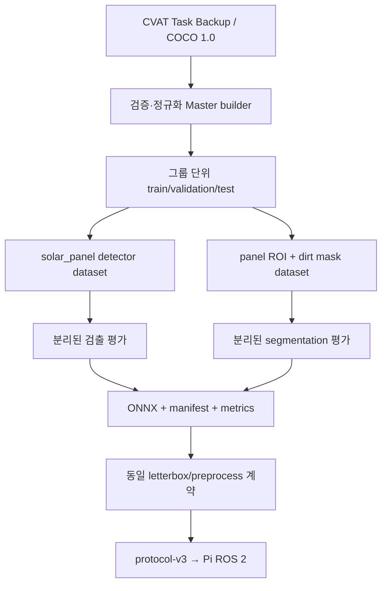

# AI 데이터·학습·배포 파이프라인

이 문서는 저장소의 현재 구현 계약이다. 실제 weight와 데이터가 없더라도 데이터
검증부터 export까지 실행할 수 있는 코드 경로를 제공하지만, 예시 해상도와
threshold를 실비행 승인값으로 간주하지 않는다.

## 전체 흐름



프로젝트 category 이름 계약은 숫자 ID와 무관하게 다음 두 개로 고정한다.

| 이름 | CVAT shape | 의미 |
|---|---|---|
| `solar_panel` | Rectangle | 프레임에 보이는 패널의 axis-aligned bbox. 프레임 밖에서 잘린 패널도 보이는 범위로 표시한다. |
| `dirt` | Polygon | 오염 영역. 한 패널에 여러 polygon을 둘 수 있다. |

clean 이미지는 `solar_panel` Rectangle이 있고 `dirt`가 없다. dirty 이미지는
`solar_panel`과 하나 이상의 `dirt` polygon이 있다. 모든 이미지에는 적어도 한
개의 패널이 있어야 하며, dirt polygon은 적어도 한 panel crop과 겹쳐야 한다.
원본 CVAT Task Backup은 보존 자료이며 builder는 읽기만 한다.

## 설치와 Master Dataset 생성

```bash
python -m venv .venv
source .venv/bin/activate
python -m pip install -e ./laptop_ai
python -m pip install -e './training[train,test]'
cp training/configs/dataset.example.yaml /tmp/da-daka-dataset.yaml
# /tmp/da-daka-dataset.yaml의 sources, grouping metadata, output_dir 수정
da-daka-dataset --config /tmp/da-daka-dataset.yaml
```

입력 `type`은 `cvat_backup`, `coco`, `auto`다. CVAT backup ZIP/디렉터리에는
`task.json`, `annotations.json`, `data/`의 원본 이미지가 있어야 한다. lightweight
backup처럼 이미지가 없으면 거부하고, 이미지가 포함된 COCO 1.0 export를 별도
source로 사용한다. COCO ZIP은 `instances*.json`과 JSON의 `file_name`에 대응하는
이미지를 포함해야 한다.

builder는 다음을 실패 또는 명시적 report로 처리한다.

- 이미지 누락, orphan annotation, 알 수 없는 category, shape/category 불일치
- 실제 decode 크기와 COCO width/height 불일치
- 비유한 값, 빈/경계 밖 bbox, 3점 미만·홀수 좌표·0면적·경계 밖 polygon
- 같은 SHA-256 이미지 중복. 기본 `duplicate_policy: error`; 검토 후에만
  `keep_first`를 사용할 수 있다.
- 원래 파일명 충돌. 원본은 수정하지 않고 source/task/index/SHA를 포함한 고유
  이름으로 복사하며 충돌 목록을 manifest에 기록한다.
- category 이름 정규화 및 alias 적용 후 `solar_panel=1`, `dirt=2`로 재매핑
- image/annotation ID를 1부터 재생성하고 `annotation.image_id` 참조를 보존

출력 디렉터리가 이미 존재하면 덮어쓰지 않는다. staging 디렉터리에서 전체 검증
후 원자적으로 완성 경로로 옮긴다.

```text
<dataset-root>/
├── annotations/{master,train,validation,test}.json
├── images/
├── dataset_manifest.json
├── dataset_summary.json
├── provenance.json
├── panel_detection/{images,annotations}/
└── dirt_segmentation/
    ├── {train,validation,test}/{images,masks}/
    ├── samples.jsonl
    └── dataset.json
```

`dataset_manifest.json`은 dataset version/fingerprint, source bundle SHA-256,
생성 UTC, git commit, split seed/ratio, category/count/충돌/중복을 기록한다.
`provenance.json`은 각 원본 이미지의 source task/path, original/normalized
filename, SHA-256, capture session, burst/panel/split group, split, panel instance
수와 clean/dirty를 기록한다. dataset fingerprint에서는 저장 장치의 절대 경로와
생성 시간을 제외하므로 같은 content/config는 다른 위치에서도 같은 식별자를
얻는다.
형식 참고용 파일은 `training/schemas/dataset_manifest.schema.json`과
`training/examples/dataset_manifest.example.json`이다. example의 `<...>`는 실제
builder 출력으로만 대체하며 손으로 dataset identity를 만들지 않는다.

## Leakage 방지 split

split은 ROI를 만들기 전에 원본 이미지에 대해 결정한다. 우선순위는
`panel_group → burst_group → capture_session → source_task`이며 가장 구체적인
가용 group을 사용한다. 같은 group은 절대로 서로 다른 split으로 분리하지 않는다.
`group_map` 또는 `group_regex`로 촬영 세션, 연속촬영, 동일 패널 정보를 제공한다.
그 정보가 없으면 안전하게 CVAT Task 전체가 한 group이 된다. seed와 최종 배정은
manifest에 저장된다. 데이터가 매우 적어 어떤 split이 비게 되는 경우도 임의로
이미지를 누출시키지 말고 source/group을 더 수집한다.

panel detection 파생 COCO에는 `solar_panel` bbox만 남는다. dirt dataset은 각
panel Rectangle을 crop하고 그 안에 겹치는 모든 dirt polygon을 하나의 binary
mask로 합친다. dirt가 없는 panel crop은 반드시 all-zero negative sample로
남는다. 따라서 같은 원본/촬영 group의 ROI가 train과 test 양쪽으로 이동하지
않는다.

## 데이터 분석과 해상도 선택

```bash
da-daka-analyze-dataset \
  --dataset-root <DATASET_ROOT> \
  --candidates training/configs/resolution_candidates.yaml \
  --output <REPORT.json>
```

이 도구는 ROI width/height, aspect ratio, dirt area ratio, 개별 dirt component
pixel area 분포와 후보 입력 크기의 scale/padding 분포를 계산한다. 저장소에 있는
`512×512`, `640×384`, `640×320`, `640×640`, `768×448`은 비교 시작점일 뿐
정답이 아니다. 각 후보를 같은 validation set으로 학습·평가하여 IoU, Dice,
dirty recall, false-clean, small-dirt recall, centroid error, mean/p95/p99 latency와
target 장치 memory를 함께 비교한다.

## 학습과 augmentation

```bash
da-daka-train-panel --config training/configs/panel_detector.yaml
da-daka-train-dirt --config training/configs/dirt_segmenter.yaml
```

panel 경로는 torchvision Faster R-CNN MobileNetV3 FPN을, dirt 경로는 LRASPP
binary segmenter를 제공한다. architecture는 Hailo operator 지원과 실측 정확도를
확인한 뒤 config/code로 명시적으로 교체할 수 있다. `pretrained`, batch, epoch,
optimizer, input width/height는 config에 있고 checkpoint에는 전체 config와 dataset
version/fingerprint가 저장된다. `seed`와 `deterministic`은 Python/NumPy/Torch,
DataLoader shuffle 및 sample/epoch augmentation을 재현 가능하게 고정한다. 지원하지
않는 비결정 CUDA kernel은 조용히 계속하지 않고 오류가 나므로, library/driver와
GPU도 학습 기록에 남긴다.

훈련 전용 augmentation은 brightness/exposure, color, shadow, 제한된 specular,
motion/defocus blur, noise, JPEG degradation을 제공한다. dirt ROI에는 mask와 동기화된
작은 perspective/scale 변화도 적용한다. 확률과 강도는 YAML에 있으며 validation과
test에는 적용하지 않는다. iPhone 사진만으로 최종 모델을 승인하지 말고 실제
Pi IMX708 장착 상태의 거리·노출·반사·motion을 포함한 현장 frame을 반드시 추가해
domain gap을 재평가한다.

## 평가와 threshold

panel detector와 dirt segmenter의 결과는 합쳐서 한 숫자로 보고하지 않는다.

| 모델 | 필수 report |
|---|---|
| panel detector | precision, recall, mAP@0.50:0.95, partial-panel recall, small/distant-panel recall |
| dirt segmenter | IoU, Dice, dirty recall, clean specificity, false-clean, false-dirty, small-dirt recall, centroid error(px 및 ROI diagonal 정규화) |

segmentation probability `.npy`를 validation sample ID별로 저장한 후 threshold를
다음처럼 sweep한다.

```bash
da-daka-threshold-sweep \
  --dataset-root <DATASET_ROOT> \
  --predictions-dir <VALIDATION_PROBABILITIES> \
  --start 0.05 --stop 0.95 --step 0.05 \
  --minimum-component-area <CANDIDATE_PIXEL_AREA> \
  --minimum-component-area-ratio <CANDIDATE_AREA_RATIO> \
  --output <THRESHOLD_REPORT.json>
```

0.50은 placeholder다. 최종 threshold는 false-clean 위험을 우선 검토하면서
precision/recall/IoU/Dice/false-clean/false-dirty를 함께 보고 사람이 승인한다.
threshold와 component filter 후보는 runtime과 같은 connected-component 구현으로
함께 평가한다.
테스트 split은 threshold나 해상도 선택에 사용하지 않고 최종 잠금 평가에만 쓴다.

학습 명령은 dirt validation probability를 run의 `validation_probabilities/`에
저장한다. 해상도·architecture·threshold를 잠근 뒤 test split을 한 번 평가한다.

```bash
da-daka-evaluate-model \
  --checkpoint <DIRT_RUN/checkpoint.pt> --split test \
  --threshold <APPROVED_THRESHOLD> --output-dir <NEW_TEST_REPORT_DIR>

da-daka-evaluate-model \
  --checkpoint <PANEL_RUN/checkpoint.pt> --split test \
  --score-threshold <APPROVED_SCORE_THRESHOLD> \
  --output-dir <NEW_TEST_REPORT_DIR>
```

## 공통 전처리와 좌표 복원

학습 dataset과 laptop runtime은 `laptop_ai.preprocessing`의 같은 구현을 쓴다.

```text
BGR panel ROI
→ manifest color order(RGB/BGR)
→ aspect ratio 유지 resize
→ manifest padding_value로 letterbox
→ float32 × scale → mean/std
→ NCHW
```

`1000×350 → 512×512` 같은 비등방 resize는 사용하지 않는다. 후처리는 scale과
left/top/right/bottom padding을 보존한 `LetterboxTransform`으로 padding을 제거하고
mask/bbox/centroid를 원래 ROI pixel로 역변환한 뒤 full-frame 좌표로 평행 이동한다.
input width/height, interpolation, padding, color, dtype, scale, mean/std는 모델별
manifest가 유일한 배포 계약이다.

## 모델 export와 manifest

```bash
da-daka-export-model \
  --checkpoint <RUN/best.pt> \
  --metrics <LOCKED_VALIDATION_REPORT.json> \
  --threshold <APPROVED_THRESHOLD> \
  --output-dir <NEW_MODEL_BUNDLE>
```

새 출력 디렉터리에는 `model.onnx`, `model.json`, `metrics.json`과
`hailo_deployment.json`이 생긴다. 원 checkpoint는 training run에 보존하고 그
SHA-256을 model manifest에 기록한다. 실제 weight/output은 Git에 커밋하지 않는다.
`model.json`은 input shape/preprocess/output activation/output shape/threshold,
component filter/selection, dataset version/fingerprint, model SHA-256와 git commit을
기록한다. ONNX 자체에도 task, activation, manifest version custom metadata를
기록한다. runtime은 model hash, manifest, ONNX metadata와 실제 input/output
metadata가 모두 일치하지 않으면 시작을 거부하며, panel/dirt bundle의 dataset
version/fingerprint가 서로 달라도 worker를 시작하지 않는다. output 범위를 보고 sigmoid
적용 여부를 추측하지 않는다.

배포 전 두 bundle을 독립적으로 검사할 수 있다.

```bash
da-daka-verify-model --task panel_detection \
  --manifest <PANEL_BUNDLE/model.json>
da-daka-verify-model --task dirt_segmentation \
  --manifest <DIRT_BUNDLE/model.json>
```

## runtime 후처리와 protocol-v3

segmentation 출력은 manifest의 `logits` 또는 `probability` 계약대로만 활성화한
뒤 threshold하고 원 ROI로 복원한다. `connectedComponentsWithStats`로 분리한 각
component에 minimum pixel area와 minimum area ratio를 개별 적용한다. 각 component는
area, bbox, centroid, mean foreground confidence를 가진다. target 선택은 정규화한
area/confidence/노즐 목표점 거리의 가중합이며 동률은 안정적인 geometry 순서로
결정되는 deterministic policy다.

protocol-v3은 모든 panel candidate의 존재인 `panel_visible`과 center gate를 통과한
`target_panel_selected`를 분리하고 선택된 candidate ID를 함께 보낸다. 따라서 candidate가 있으나 목표가 선택되지 않은
경우 `panel_visible=true`, `target_panel_selected=false`, `valid=false`,
`invalid_reason=panel-not-centered`가 된다. dirty 결과는 선택 component의
centroid/bbox/confidence와 total dirty area ratio, component count, target component
area ratio, 모델 SHA/dataset version을 함께 보낸다. 버전·source/IP·session·증가하는
sequence/frame·timestamp·범위 불일치는 Pi receiver에서 fail-closed다.

clean은 한 frame으로 확정하지 않는다. `autonomous_cleaning.yaml`의 서로 다른 fresh
frame을 사용해 dirty는 빠르게, clean은 기본 3개 연속 clean frame 뒤 확정한다.
동일/out-of-order frame은 vote가 아니다. post-spray에서는 기존 분사 완료 시점의
session/frame/sequence barrier보다 새로운 frame만 사용하고 최대 재시도 3회 정책을
그대로 유지한다.

visual servo는 dirty 결과에서는 선택 dirt component centroid를 사용한다. 분사 후
오염이 사라진 clean frame에서도 선택 panel candidate 중심을 임시 관측점으로 써서
정렬 상태를 잃지 않고 전체 panel ROI를 검증한다. candidate ID가 panel array를
참조하지 않으면 receiver가 packet을 거부한다.

## backend와 배포 상태

동일 manifest/preprocess/postprocess/threshold/component 계약 위에서 backend를
교체하는 것이 목표다. 현재 저장소에서 **구현·CI 검증된 실행 경로는 NVIDIA
laptop ONNX Runtime CUDA + UDP offload**다. Raspberry Pi 5 + AI HAT+ 13 TOPS는
희망 production target이지만 `vision/hailo_dirt_detector.py`는 의도적으로
fail-closed다. ONNX를 HEF로 이름만 바꾸거나 RuntimeError를 제거해서는 안 된다.

Hailo 경로를 production으로 선택하려면 같은 dataset/model SHA에 대해 다음을
완료한다.

1. target HailoRT/DFC 버전 고정 및 ONNX operator parse 확인
2. 대표 IMX708 calibration set으로 quantization/optimization
3. Hailo-8L용 HEF compile과 manifest/HEF hash 연결
4. ONNX 대 HEF의 panel/segmentation/centroid/false-clean 동등성 평가
5. Pi에서 카메라 decode→전처리→HEF→공통 후처리 전체 latency/온도/memory 측정
6. Hailo용 adapter와 hardware-in-loop test 추가 후 production config 전환

그 전에는 CUDA laptop이 필요하다. 반대로 위 검증이 끝나면 flight owner를 바꾸지
않고 Pi 내부 inference adapter로 교체할 수 있다. 어느 backend에서도 불완전 packet,
model/manifest mismatch, stale perception이 configuration/calibration/spray approval을
우회하지 못한다.

## benchmark와 실비행 전 승인

`da-daka-segmentation-benchmark`는 zero tensor의 ONNX microbenchmark다. 실제 성능
승인에는 다음 end-to-end benchmark를 사용한다.

```bash
da-daka-production-benchmark \
  --config laptop_ai/config/laptop_ai.yaml \
  --dataset-root <DATASET_ROOT> \
  --output <PRODUCTION_BENCHMARK.json>
```

validation ROI의 disk read를 제외한 preprocess→target inference→postprocess를
측정해 mean/p50/p95/p99/effective FPS를 기록한다. benchmark는 model manifest의
dataset version/fingerprint와 Master Dataset manifest가 다르면 실행을 거부한다.
GPU/Hailo memory는 각 vendor
profiler로 peak를 별도 측정한다. CUDA에서는 가능하면 현재 process의
`nvidia-smi` allocation도 기록하고, 조회할 수 없으면 값을 만들지 않는다. 녹화 IMX708 영상 replay,
protocol freshness, mock spray, SITL, 프로펠러 제거 bench, 계류, dry run, 단일 패널,
복수 패널 순으로 검증하기 전에는 자율분사를 승인하지 않는다.
